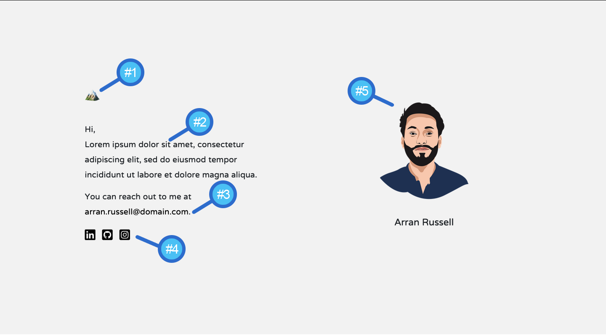
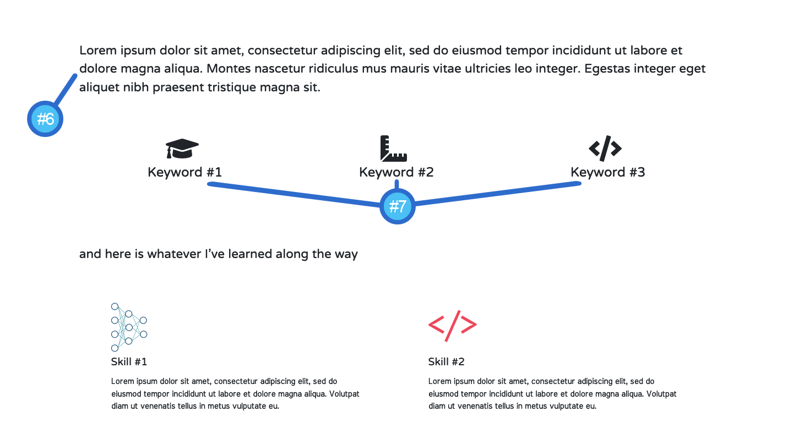
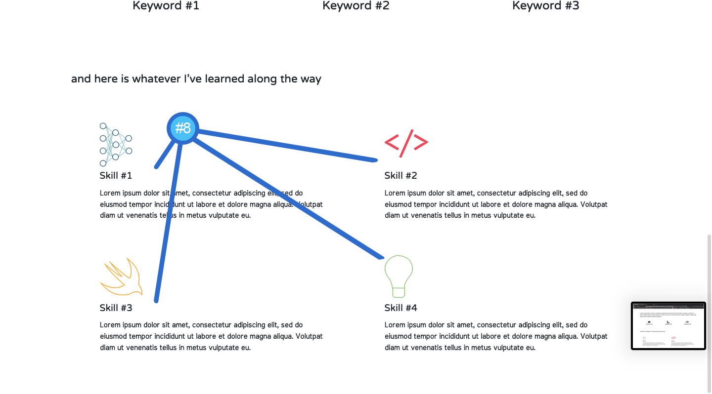
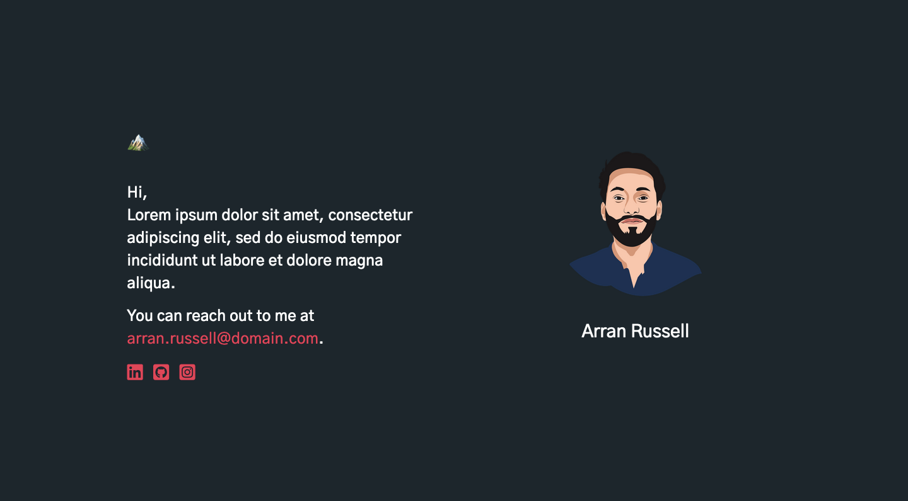
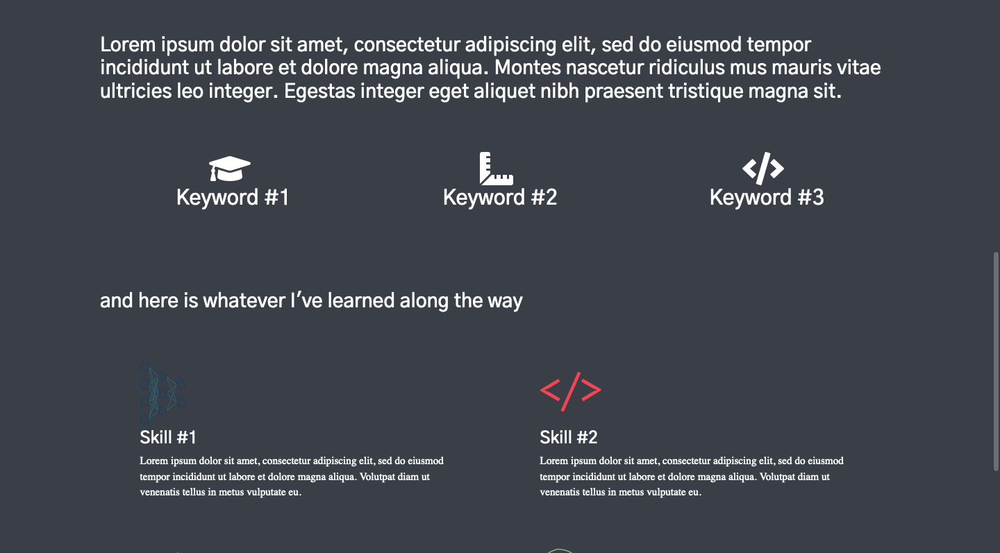
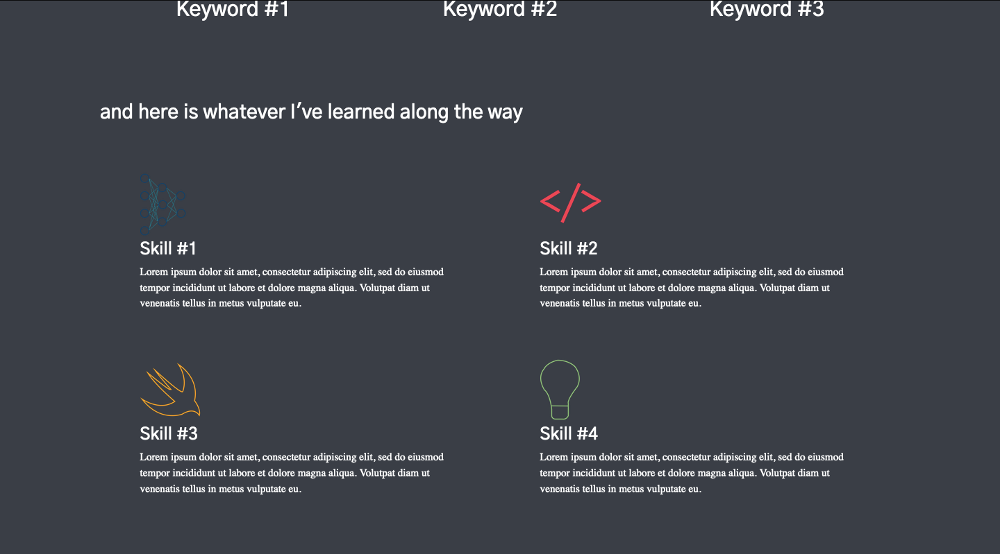

# Brief Portfolio Template

This is a simple portfolio to convey only necessary and brief information about an individual.

Created using HTML5, CSS3 and Javascript.

## Screenshots

**Screen 1**


**Screen 2**


**Screen 3**


## Editing Information

You can replace the information in the file ```index.html```, by locating the following elements by number and editing the content.

## Dark Mode Alternate
Screen 1

Screen 2

Screen 3


To change to this design,
1. Install 'Gothic A1' font from Google Fonts.
2. Change the following properties in ```styles.css``` file:
- ```body```
  - ```font-family: 'Gothic A1', sans-serif;```
  - ```background-color: #1b262c;```
  - ```color: white;```
- ```.skills```
  - ```background-color: #393e46;```
- ```.intro-text a, .intro-text a:visited```
  - ```color: #f0134d;```

### References
- Loading Screen: [Youtube Video from Red Stapler.](https://www.youtube.com/watch?v=gttmqvZ4kYc)
