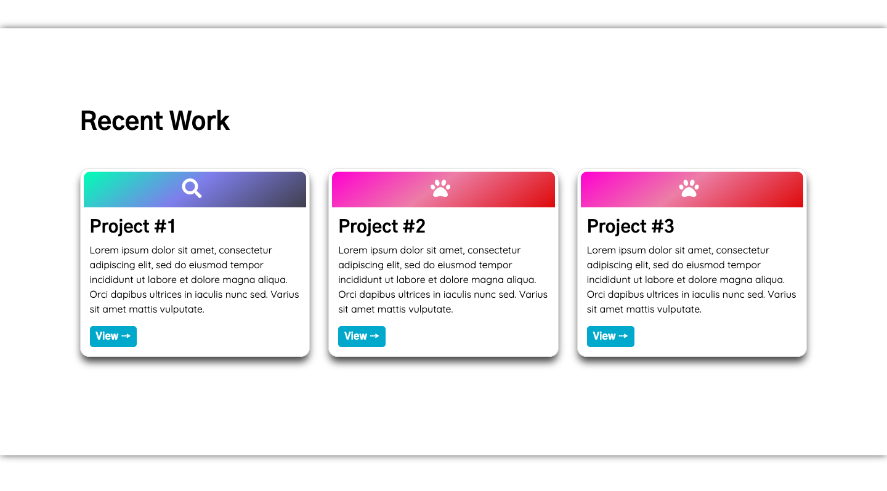

# Light & Dark Mode Portfolio Template

This is a simple portfolio to convey only necessary and brief information about an individual, with the feature of light and dark mode, triggered by the icon on the top.

Created using HTML5, CSS3 and Javascript.

## Screenshots
**Screen 1**

Dark Mode


Light Mode

**Screen 2**

Dark Mode


Light Mode

**Screen 3**

Dark Mode


Light Mode

**Screen 4**

Dark Mode


Light Mode

## Editing Information

You can replace the information in the file ```index.html```.
