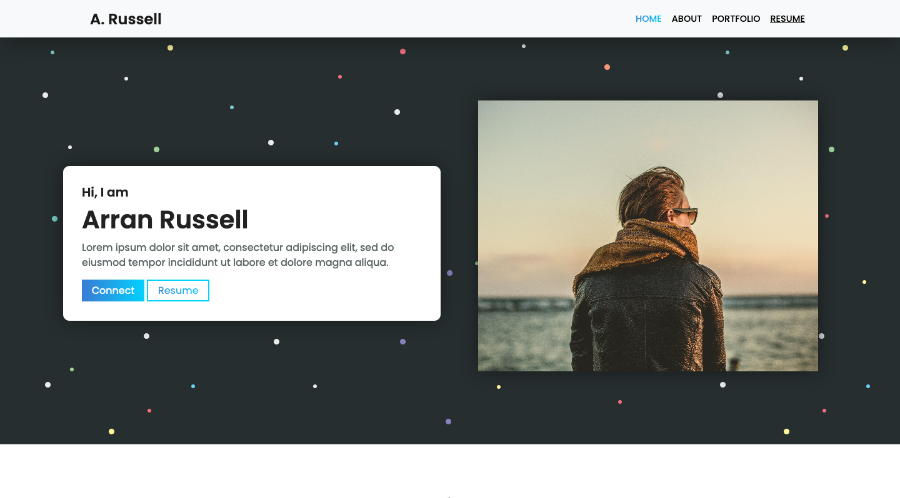
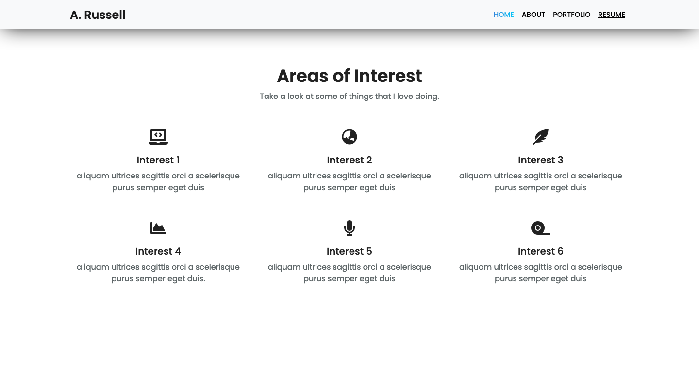
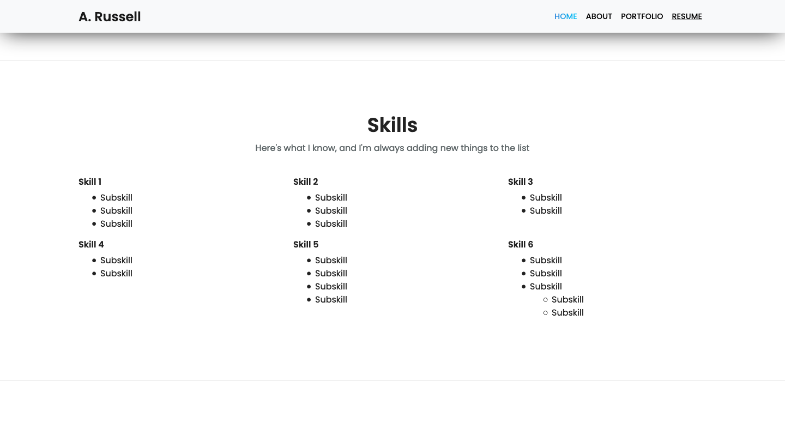
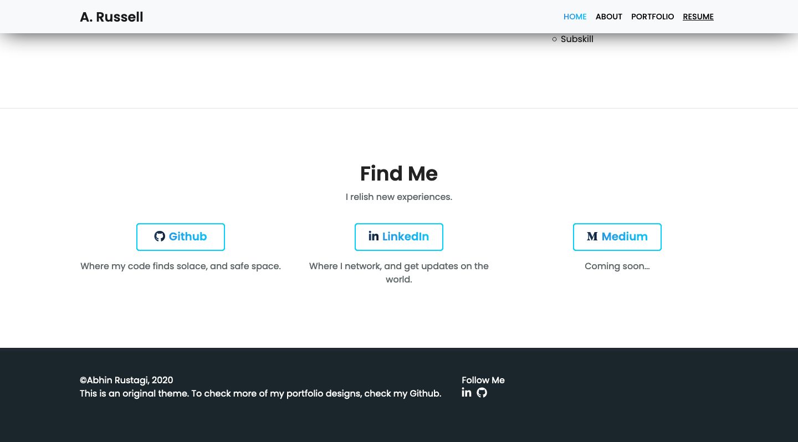
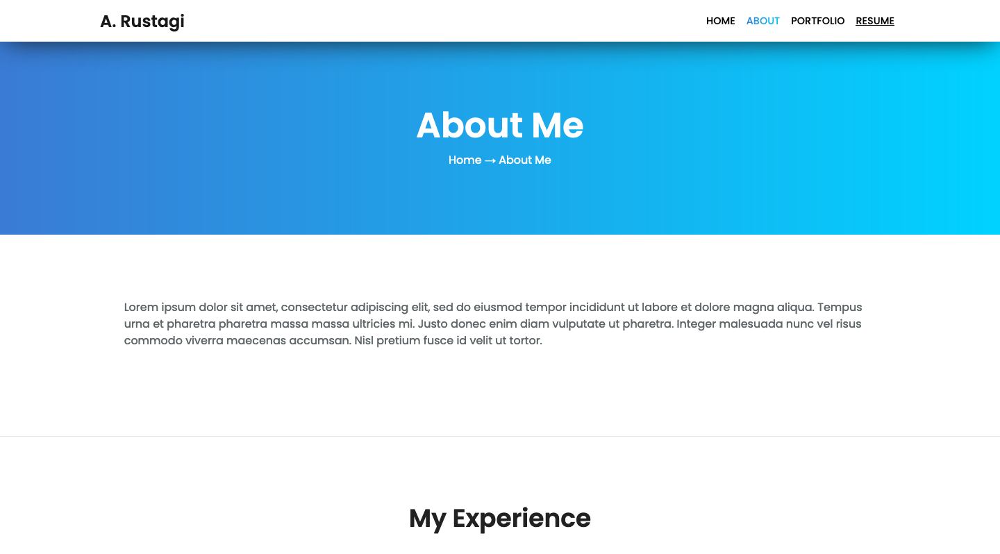
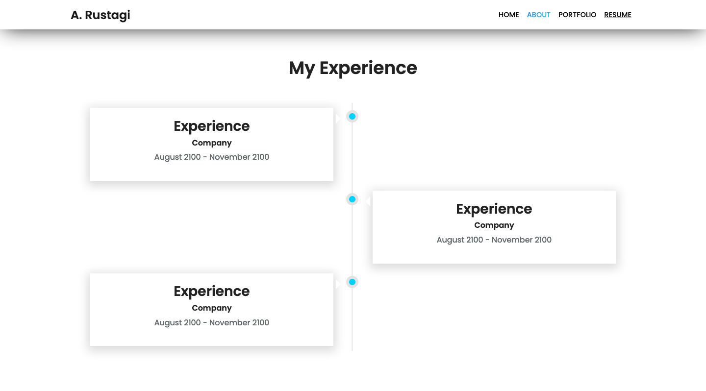
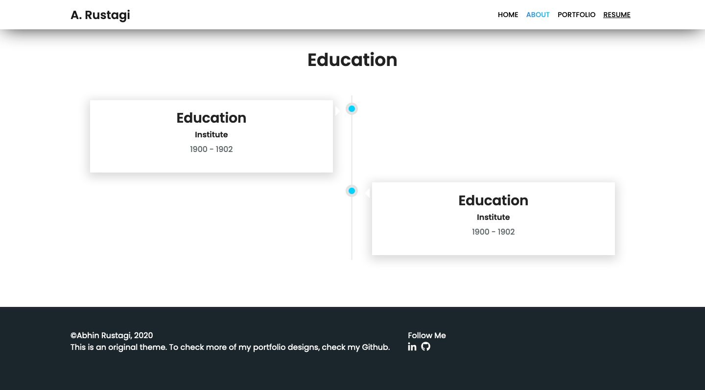
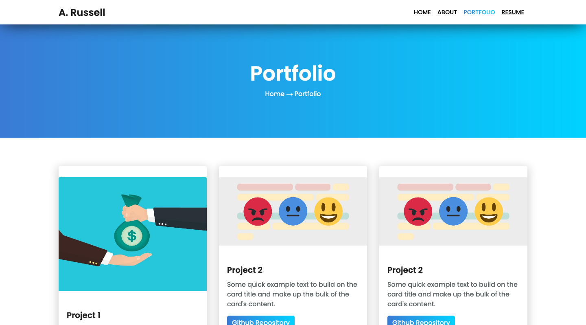

# Multi Page Template

This is a simple multi-page portfolio template.

Created using HTML5, CSS3 and Javascript.

## Screenshots

### Home Page

**Screen 1**


**Screen 2**


**Screen 3**


**Screen 4**


### About Page

**Screen 5**


**Screen 6**


**Screen 7**


### Portfolio Page

**Screen 8**


## Editing Information

You can replace the information in the file ```index.html```.
